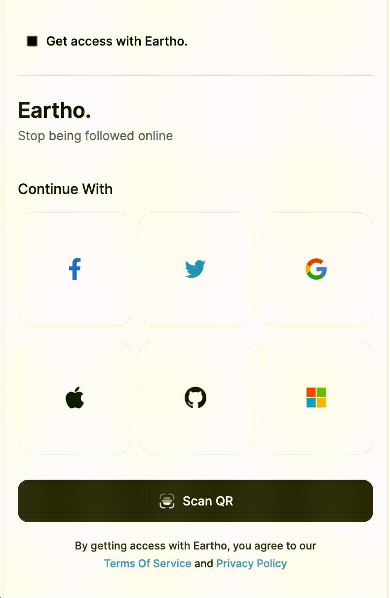

<!--
*** Thanks for checking out the Best-README-Template. If you have a suggestion
*** that would make this better, please fork the repo and create a pull request
*** or simply open an issue with the tag "enhancement".
*** Don't forget to give the project a star!
*** Thanks again! Now go create something AMAZING! :D
-->
<!-- PROJECT LOGO -->
 

  

  <h1 align="center">Eartho. One</h1>

  

    Develop fast<br/ >
    Get users from all sources into your app fast! 
    We are a third layer that abstracts the complexity for you and protects your users from being tracked.
      
    <a href="https://www.eartho.world/product/learn"><strong>Explore the docs »</strong></a>
     
     
    <a href="https://eartho.world">Our Website</a>
    ·
    <a href="https://github.com/eartho-group/one-client-flutter/issues">Report Bug</a>
    ·
    <a href="https://github.com/eartho-group/one-client-flutter/issues">Request Feature</a>
  

<!-- ABOUT THE PROJECT -->
## About The Project

 

 
Get all integrations at once. No extra steps.
From improving customer experience through seamless sign-on to making auth as easy as a click of a button – your login box must find the right balance between user convenience, privacy and security.

Here's why:
* Login from Google, Twitter, Github, Facebook, Apple, Microsoft at once with not extra steps or extra effort.
* Your users will be protected under our third layer, we prevent from companies to track after your users.
* Advaned analytics and info about your app from all sources. ready for use. no extra steps

(<a href="#top">back to top</a>)

<!-- GETTING STARTED -->
## Getting Started

We manage our documents on our website as a single source of truth.
Open our quick start guide to get started.

https://www.eartho.world/product/learn

(<a href="#top">back to top</a>)

<!-- USAGE EXAMPLES -->
## Usage

Check the example folder

(<a href="#top">back to top</a>)

<!-- LICENSE -->
## License

Distributed under the Mozilla Public License Version 2.0. See `LICENSE` for more information.

(<a href="#top">back to top</a>)

<!-- CONTACT -->
## Contact

Eartho - [@eartho_world](https://twitter.com/eartho_world) - contact@eartho.world

Project Link: [https://github.com/eartho-group/](https://github.com/your_username/group)

(<a href="#top">back to top</a>)

<!-- MARKDOWN LINKS & IMAGES -->
<!-- https://www.markdownguide.org/basic-syntax/#reference-style-links -->
[contributors-shield]: https://img.shields.io/github/contributors/othneildrew/Best-README-Template.svg?style=for-the-badge
[contributors-url]: https://github.com/othneildrew/Best-README-Template/graphs/contributors
[forks-shield]: https://img.shields.io/github/forks/othneildrew/Best-README-Template.svg?style=for-the-badge
[forks-url]: https://github.com/othneildrew/Best-README-Template/network/members
[stars-shield]: https://img.shields.io/github/stars/othneildrew/Best-README-Template.svg?style=for-the-badge
[stars-url]: https://github.com/othneildrew/Best-README-Template/stargazers
[issues-shield]: https://img.shields.io/github/issues/othneildrew/Best-README-Template.svg?style=for-the-badge
[issues-url]: https://github.com/othneildrew/Best-README-Template/issues
[license-shield]: https://img.shields.io/github/license/othneildrew/Best-README-Template.svg?style=for-the-badge
[license-url]: https://github.com/othneildrew/Best-README-Template/blob/master/LICENSE.txt
[linkedin-shield]: https://img.shields.io/badge/-LinkedIn-black.svg?style=for-the-badge&logo=linkedin&colorB=555
[linkedin-url]: https://linkedin.com/in/othneildrew
[product-screenshot]: github/images/eartho.gif

